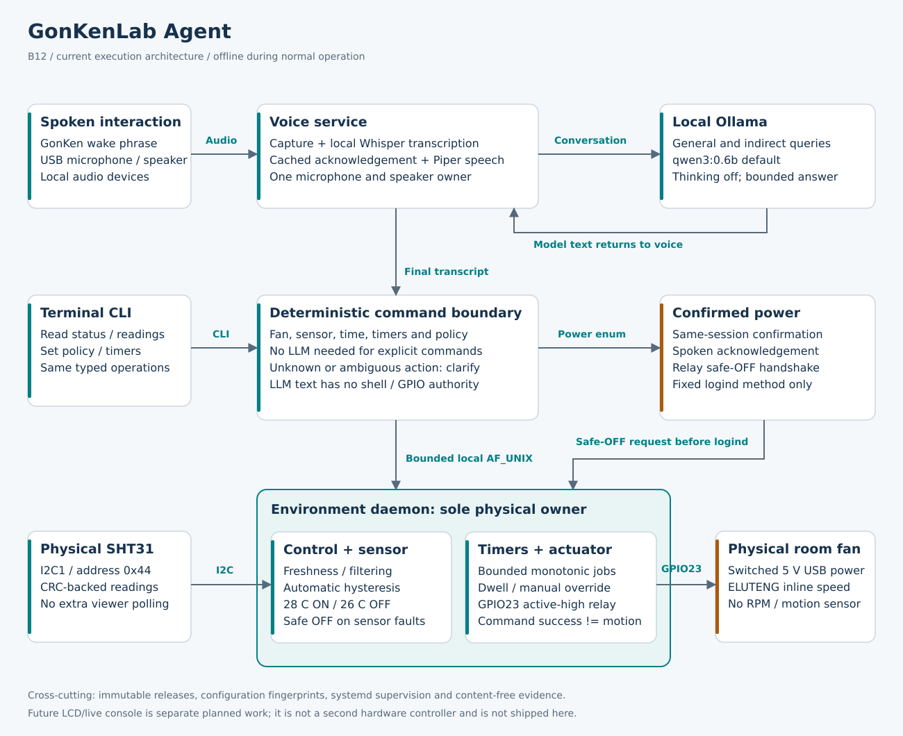

# GonKenLab Agent

**B15 voice-runtime repair checkpoint.** A local, voice-first
Raspberry Pi assistant with real temperature/humidity sensing, automatic room-fan
control, bounded timers, and explicitly confirmed reboot/shutdown. The existing
Attempt03 programme also contains later display and cleanup work; those items are
not implied complete by this candidate. [Current disposition](docs/CURRENT_STATE.md)
and the supplied verification receipt state exactly what was tested.

[Install](#1-install-this-exact-package) | [Voice examples](#2-voice-command-catalogue) |
[Terminal examples](#3-terminal-command-catalogue) | [Timer semantics](#4-timers-modes-and-safety) |
[Architecture](docs/ARCHITECTURE.md) | [Troubleshooting](#6-diagnose-without-guessing)



## 1. Install this exact package

For the downloaded B15 package, use the [B15 upgrade instructions](docs/development/b15/INSTALL_AND_VERIFY.md).
B15 is not automatically installed by pulling `main`: this delivery does not push
or merge GitHub. Run from the clean extracted full-Git B15 directory:

```bash
./bootstrap.sh --local-checkpoint --environment-profile full-real --environment-mode preserve --appliance-preset none
```

These maintenance options preserve your existing thresholds, mode and selected
model rather than reapplying the factory responsive-room preset. No wiring change
is part of B15. The general post-merge/fresh-machine workflows below remain valid
for their explicitly stated purpose.

Target: Raspberry Pi 5, Raspberry Pi OS Lite 64-bit / Debian Trixie, the already
wired SHT31 on I2C1 at **0x44**, and an **active-high BCM GPIO23** relay switching
ELUTENG USB fan power. GPIO23 is physical header pin 16. The room fan is **not**
the Raspberry Pi Active Cooler. Power switching is supported; software fan speed,
RPM measurement and independent fan-motion sensing are not.

Disconnect power before changing wiring. Do not add a second GPIO controller or
use `gpioset` during ordinary operation: `gonken-environment.service` owns the line.
See [hardware setup](docs/HARDWARE_SETUP.md) before changing any connection.

The normal Git workflow is now the primary installation path. After the verified
release branch has been merged into `main`, update the existing clean Pi checkout:

```bash
cd "$HOME/gonkenlabagent"
git checkout main
git pull --ff-only origin main
./bootstrap.sh
```

A no-argument target `./bootstrap.sh` selects the same standard room-appliance
profile as `install-room-appliance.sh`: real SHT31, real GPIO23 relay, automatic
mode and the responsive-room preset. Explicit environment/preset arguments still
override this default.

For a fresh machine, the streamed launcher uses the same governed bootstrap path:

```bash
curl -fsSL https://raw.githubusercontent.com/mukulu/gonkenlabagent/main/install-gonken.sh | bash
```

The curl launcher only prepares/updates the Git checkout and delegates to
`./bootstrap.sh`; it does not maintain a second installation implementation.
`./install-room-appliance.sh` remains available when deliberately installing an
exact downloaded checkpoint with `--local-checkpoint`. Installation may download
pinned dependencies and model assets; normal control and conversation are local.
The source archive does not contain gigabytes of model weights.

The explicit `responsive-room` preset does the following:

| Setting | Selected value |
|---|---|
| Sensor / actuator | Real SHT31 / libgpiod relay; no simulated fallback |
| Policy | Automatic; fan ON at/above **28 C**, OFF at/below **26 C** |
| Dwell | Preserve existing valid minimum ON/OFF; factory value 60 seconds each |
| Default conversational model | **`qwen3:0.6b`**, the smallest admitted roster tag |
| Thinking / response budget | Thinking disabled; 96 output tokens, 2,048-token context |
| Model retention | Keep selected model loaded for up to 10 minutes of idle time |
| Power actions | Enabled with a narrow service-identity policy and explicit confirmation |
| Simulation | Runtime simulation control disabled in this real-room profile |

This preset deliberately migrates your previous valid 28/25 or 28/26.5 thermostat
range to **28/26**. Ordinary daemon restart does not reset user policy. A later
plain wrapper rerun deliberately reapplies the requested preset. To preserve a
custom model, thresholds and mode on a maintenance rerun, use
`./install-room-appliance.sh --appliance-preset none --environment-mode preserve`.
That preservation option does not undo an already enabled power policy.

The roster retains `lfm2.5-thinking:1.2b` and `qwen3.5:0.8b` as alternatives.
An optional, non-selected alternate may be reported degraded; it is not silently
substituted for the qualified default. Model family name `qwen3.5` is not itself a
parameter count. Inspect `llm status` to see what the running service actually uses.

Optional audio: `./install-room-appliance.sh --bluetooth-audio --bluetooth-device
AA:BB:CC:DD:EE:FF` uses your actual device selector in place of the example.
Usable USB capture/playback remains valid when optional Bluetooth is unavailable.
See [Bluetooth audio](docs/BLUETOOTH_AUDIO.md).

Successful completion requires current runtime postconditions, not a historical
hardware-acceptance file. The installer reconciles an already-installed selected
real thermostat before later model work, prepares candidate dependencies before
switching `current`, and restarts processes with stale release/configuration
identity. A failure still produces one canonical diagnostic `.tar.bz2`.

[Detailed room installation and rollback boundaries](docs/ROOM_APPLIANCE_INSTALL.md).

## 2. Voice-command catalogue

Say **GonKen**, wait for **Yes?**, then say the command; or say **GonKen, what is
the temperature?** as one utterance. B15 retains the entire inline utterance and
does not ask for it again. The acknowledgement is a cached fixed Piper phrase,
not an LLM request. Speak a complete timed command rather than pausing between "fan on"
and "in two minutes".

Sensor, time, fan, policy, timer and power requests use deterministic local
routing. They do **not** wait for an LLM to invent a plan. General questions such
as "Why does humidity change?" use the selected local model. Responses are short
by default; a small model is not a guarantee of factual accuracy or a substitute
for hardware state.

The examples below are checked against the current grammar. Ordinary number
words such as "twenty eight" are accepted. Unsupported or ambiguous scheduling
phrases ask for clarification rather than silently dropping their time qualifier.

### Readings and status

- **What is the room temperature?**
- **How warm is the room?**
- **What is the humidity?**
- **Tell me the temperature and humidity**
- **Is the room fan on?**
- **What are the fan settings?**

### Immediate fan control

- **Turn the fan on**
- **Turn on the fan**
- **Start the room fan**
- **Turn the fan off**
- **Stop the room fan**

### Modes

- **Use automatic mode**
- **Use manual mode**
- **Use semi automatic mode**
- **Use disabled mode**

Automatic uses both thresholds. Manual uses explicit fan requests. Semi-automatic requires a manual ON and may stop at the low threshold. Disabled commands OFF and rejects fan automation.

### Thermostat

- **Set fan on threshold to twenty eight and off threshold to twenty six**
- **Set fan on threshold to 29 and off threshold to 27**

### Time and date

- **What time is it?**
- **What is the date?**
- **Tell me the local date and time**

### Timers and announcements

- **Turn the fan on in two minutes**
- **Stop the fan after three minutes**
- **Turn the fan on in two minutes for three minutes**
- **Run the fan for three minutes**
- **Switch the fan on and off every three minutes for thirty minutes**
- **Tell me the temperature after two minutes**
- **Tell me the temperature every two minutes for one hour**
- **Report humidity every three minutes**
- **Tell me the temperature and humidity every two minutes**
- **Tell me when the temperature increases by two degrees from the last mentioned temperature**

### Timer administration

- **List timers**
- **Cancel all timers**
- **Cancel timer ab12cd34**

### Confirmed device power

- **Restart the Raspberry Pi**
- **Shut down the Raspberry Pi**

For restart, GonKen asks: "Restart the Raspberry Pi now? Say confirm restart or
cancel." Say **Confirm restart** in the same interaction. For shutdown say
**Confirm shutdown**. **Cancel** cancels either. The pending request expires after
20 seconds; a short follow-up capture is taken immediately after the prompt.
Wrong-action, expired, quoted or replayed confirmation never authorizes power.

The final acknowledgement must finish, the environment daemon must acknowledge
safe OFF, and logind/PolicyKit must permit the fixed action. Inhibitors are not
bypassed. Shutdown requires manual power-on afterward. "Restart Ollama", "restart
the fan", and "how do I reboot?" are **not** Raspberry Pi power commands.

## 3. Terminal-command catalogue

Run normal commands as the authorized administrator. The installer grants
`gonken-envctl` socket access; reconnect SSH after first provisioning if your
existing session has not acquired that group. A terminal query displays text;
it does not count as a *spoken* temperature announcement.

Timer and delay arguments below are **seconds**. Replace `ab12cd34` with an actual
ID from the timer list. The JSON form exposes precise state for automation; a
pretty response is not proof of physical fan rotation.

### Inspect

| Command | Purpose |
|---|---|
| `gonken-agent status --json` | Voice startup readiness and identity |
| `gonken-agent components --json` | Separate voice, model, sensor, relay and tool status |
| `gonken-agent wake status --json` | Wake configuration and matcher information |
| `gonken-agent env health --json` | Actual backend, command truth and sensor health |
| `gonken-agent env status --json` | Room state and capabilities |
| `gonken-agent env temperature` | Read temperature |
| `gonken-agent env humidity` | Read humidity |
| `gonken-agent env read` | Read both sensor quantities |
| `gonken-agent env policy show` | Show active thresholds, mode and dwell |
| `gonken-agent env watch --changes-only --health` | Watch meaningful control/health changes |
| `gonken-agent env watch --health` | Watch readings as well as control state |
| `gonken-agent env probe --json` | Bounded read-only probe |

### Control

| Command | Purpose |
|---|---|
| `gonken-agent env fan on` | Immediate manual ON request |
| `gonken-agent env fan off` | Immediate manual OFF request |
| `gonken-agent env mode set automatic` | Restore temperature-driven control |
| `gonken-agent env mode set manual` | Select manual operation |
| `gonken-agent env mode set semi_automatic` | Select manually armed, automatic-OFF operation |
| `gonken-agent env mode set disabled` | Disable control and command safe OFF |
| `gonken-agent env policy set --start-c 28 --stop-c 26 --mode automatic` | Set requested thermostat range and automatic mode |
| `gonken-agent env policy set --minimum-on-seconds 60 --minimum-off-seconds 60` | Set dwell deliberately; do not use short cycles on the relay |

### Schedule

| Command | Purpose |
|---|---|
| `gonken-agent command "What time is it?"` | Deterministic local clock, without inference |
| `gonken-agent command "Turn the fan on in two minutes for three minutes"` | Same operational grammar as spoken commands |
| `gonken-agent env schedule add fan_on --after 120` | One delayed ON |
| `gonken-agent env schedule add fan_off --after 180` | One delayed OFF |
| `gonken-agent env schedule add fan_run --after 120 --duration 180` | Delayed finite ON/OFF pair |
| `gonken-agent env schedule add fan_cycle --every 180 --lease 1800` | Finite cycling; 180 seconds per phase |
| `gonken-agent env schedule add temperature --after 120` | One spoken temperature reminder |
| `gonken-agent env schedule add temperature --after 120 --every 120 --lease 3600` | Repeated temperature reports for one hour |
| `gonken-agent env schedule add humidity --after 180 --every 180 --lease 3600` | Repeated humidity reports |
| `gonken-agent env schedule add environment --after 120 --every 120 --lease 3600` | Repeated temperature and humidity |
| `gonken-agent env schedule add temperature_delta --delta-c 2 --lease 3600` | Report a two-degree rise |
| `gonken-agent env schedule list --json` | IDs, next due time, expiry and timer state |
| `gonken-agent env schedule cancel ab12cd34` | Cancel one actual ID; example ID is a placeholder |
| `gonken-agent env schedule cancel all` | Cancel all pending timers |

### Administration

| Command | Purpose |
|---|---|
| `gonken-agent llm status --json` | Effective selected model and qualification |
| `gonken-agent llm models` | Available admitted roster |
| `gonken-agent llm benchmark --model qwen3:0.6b --iterations 3 --json` | Explicit bounded model test; not a wake-latency measurement |
| `gonken-agent llm capabilities --model qwen3:0.6b --json` | Explicit read-only tool qualification |
| `sudo gonken-agent llm switch qwen3:0.6b --json` | Administrator model selection; restart and rollback checks |
| `gonken-agent config show --effective --json` | Validated effective configuration, paths redacted |
| `gonken-agent config fingerprint` | Fingerprint only; no private values |
| `gonken-agent doctor` | Non-mutating diagnostics |
| `gonken-agent support --output-dir /tmp` | Canonical support archive with no conversation content |
| `gonken-agent version` | Package API version; use commit for exact build identity |
| `gonken-agent talk --seconds 8` | One foreground voice turn; stop the supervised voice service first |
| `gonken-agent run` | Foreground voice loop; do not run a second audio owner |

### Power

The administrator explicitly runs this feature as the restricted service identity,
not as root. This does not grant ordinary users sudo or a generic privileged tool.
Without `--confirm`, an interactive terminal prompts for action-specific
confirmation; noninteractive calls must supply the matching word.

| Command | Purpose |
|---|---|
| `sudo -u gonken-agent /usr/local/bin/gonken-agent power reboot --confirm restart` | Separate explicitly confirmed orderly reboot; run as the designated service identity |
| `sudo -u gonken-agent /usr/local/bin/gonken-agent power shutdown --confirm shutdown` | Separate explicitly confirmed orderly shutdown; requires manual power-on afterward |

### Advanced

These interfaces require their documented corpus/configuration prerequisites.
They are not the everyday room-control route. The diagnostic loopback dashboard
is not the future LCD live-console feature. Simulation remains a development
facility; the real-room preset does not enable it. Do not start a second daemon.

| Command | Purpose |
|---|---|
| `gonken-agent index build --index /srv/gonken-agent/index --calibration /srv/gonken-agent/calibration.json` | Advanced calibrated local-corpus indexing |
| `gonken-agent index verify --index /srv/gonken-agent/index` | Validate an existing corpus index |
| `gonken-agent ask "Explain this topic" --index /srv/gonken-agent/index --extractive` | Local-corpus excerpt diagnostic, not the voice/control route |
| `gonken-agent run --text-only --index /srv/gonken-agent/index --extractive` | Interactive corpus text diagnostic |
| `gonken-agent dashboard --index /srv/gonken-agent/index` | Optional loopback-only diagnostic view; not the planned LCD console |
| `gonken-agent env simulate status` | Development only; not used by the full-real room deployment |

### Service operations: administrator only

These terminal commands manage systemd, not the model. Do not use two foreground
voice processes alongside the supervised service.

```bash
sudo systemctl status gonken-agent.service gonken-environment.service --no-pager
sudo systemctl restart gonken-agent.service
sudo systemctl restart gonken-environment.service
sudo journalctl -fu gonken-environment.service
sudo journalctl -u gonken-agent.service -b --no-pager -n 100
```

For foreground audio diagnostics, stop `gonken-agent.service`, run `gonken-agent
talk --seconds 8` or `gonken-agent run`, then start the service again. The
thermostat remains independently supervised. Use `gonken-agent --help` and
`gonken-agent env schedule add --help` for the exact complete option surfaces.

The former root prototype runtime, `run --legacy-source`, and legacy config
migration are retained compatibility interfaces, not supported shortcuts for this
candidate. Do not use them to bypass the current installer or resource ownership.

## 4. Timers, modes and safety

**Timers are boot-scoped, not persistent automation.** They live in the environment
daemon's bounded memory. Restarting that daemon, rebooting or updating clears
them; missed events are not replayed after downtime. Normal thermostat policy
persists separately. Maximum 32 active jobs; repeated jobs have an explicit finite
lease (default eight hours; a shorter duration is recommended). The lease begins
at the first due time. Maximum initial delay is 24 hours. Repeated reports must
be at least 60 seconds apart; relay cycles must also respect configured dwell.

A delayed ON/OFF switches to an in-memory manual override at execution time.
A timed fan run measures its duration from the successful ON request, not from
creation. A fan cycle starts ON when eligible, alternates at the requested phase
interval, and commands OFF at lease expiry. Sensor faults, disabled mode and power
preparation cancel relevant fan work. A direct fan/mode/policy intervention cancels
pending fan timers so a forgotten job cannot silently undo it. Read-only reporting
jobs remain independent. Cancel an active timed run to command it OFF; explicitly
restore **automatic mode** afterward when temperature control should resume.

Minimum dwell can delay scheduled transitions. Do not stack a run/cycle on other
fan timers; cancel the earlier fan schedule first. Safety OFF overrides ordinary
dwell. Reported state distinguishes desired fan power, successfully commanded
relay state and **unobserved** fan motion. `physical_evidence=false` is not simulation
and is not a runtime lock.

Sensor reminders are spoken by the existing voice service while it is idle. Busy
or unavailable audio does not stop the thermostat. Notification queues are bounded;
stale notices expire after 30 seconds instead of producing a backlog of old
readings. A temperature-rise watcher compares fresh readings with the last
successfully spoken temperature; absent one, it uses the reading at registration.
Only successful speech acknowledgement updates that baseline. Delta units are
**degrees Celsius**, not minutes. No falling-temperature rule or arbitrary
conditional scripting language is implied by this first grammar.

## 5. Responsiveness and architecture

The responsive preset uses `qwen3:0.6b`, thinking off, a 96-token response ceiling,
and a bounded context. Operational commands bypass inference. Piper's fixed wake
and progress cues are cached; user speech and answers are not cached in that
persistent cue store. Question capture can end after sustained speech followed by
900 ms of silence rather than always waiting eight seconds. Continuous noise,
uncertain speech completion or silence still uses the bounded maximum window.

B15 additionally uses streaming phonetic keyword detection plus a bounded
utterance buffer instead of repeatedly transcribing silent wake windows. Native
misses use one complete-utterance Whisper fallback. These are implemented latency
reductions, **not measured Raspberry Pi latency promises**. Command transcription,
microphone routing and acoustic recognition still need real-target measurement;
a smaller conversational model alone cannot make
that path instantaneous. Audio noise, CPU load and model cold-start remain relevant.
`llm benchmark` measures model transactions, not microphone-to-speaker latency.

Read [the current architecture and component ownership guide](docs/ARCHITECTURE.md)
for the SVG diagrams, exact modules, IPC boundaries, deployment sequence, safety
rules and extension points. Environment code owns the sensor, filtered control
state and relay. Voice owns microphone/speaker access. Timers belong to environment
control, not to a model-generated script. The model answers general questions;
it does not issue raw GPIO or shell commands.

## 6. Diagnose without guessing

After installation, verify actual selected state:

```bash
gonken-agent llm status --json
gonken-agent config show --effective --json
gonken-agent env health --json
gonken-agent env policy show
gonken-agent components --json
```

Expect `qwen3:0.6b`, real `sht31` and `libgpiod`, both simulation flags false, mode
`automatic`, start 28 and stop 26. Status may still say physical evidence is false:
that is independent from whether the backend is real. An OFF fan below the start
threshold, during valid-sample recovery, or during dwell is expected.

On failure upload the **single `.tar.bz2` path printed by the installer**. It
combines installer facts and available canonical support sections. Ordinary
post-install support is `gonken-agent support --output-dir /tmp`. Do not include
raw conversation recordings or unrelated credentials. Exact reason codes, route
identity, runtime/config fingerprints and model qualification are more useful
than repeatedly rewriting the same valid hardware configuration.

The earlier physical fan cycle used a different logged release. It informs this
repair but is not falsely relabeled current-build physical acceptance. No previous HIL report
is required as a runtime prerequisite. Required current configuration, permissions,
actual device availability and semantic readiness are still checked.

If time announcements use an unexpected timezone, inspect `timedatectl`; the
assistant reports the Pi's clock, not a guessed location. To deliberately configure
this Tokyo installation, an administrator may use `sudo timedatectl set-timezone
Asia/Tokyo`. The installer does not change unrelated system timezone settings.

## 7. Development, recovery and feature boundary

This package includes committed source and full Git history. The API version can
remain `0.2.0.dev0`; the adjacent receipt and Git commit identify the exact build.
Development/WIP commits are not release acceptance. The strict whole-Attempt03
promotion gate remains separate from qualification of this installation candidate.
Run `scripts/current_state.py --check` and `scripts/release_readiness.py --validate`
for consistent development state; `--check` on release readiness requires the
entire recorded release scope and can correctly report `NOT_READY`.

The OSOYOO display/live-console, touch/backlight qualification and parts of the
repository/lifecycle modernization remain explicitly tracked, **not implemented
by the diagrams**. This build provides the commands documented above; it does not
provide `gonken-agent console`, an on-screen keyboard, touch fan/power controls,
persistent schedules, fan RPM or unrestricted voice scripting.

See [implementation disposition](docs/CURRENT_STATE.md), [operations](docs/OPERATIONS.md),
[environment control](docs/ENVIRONMENT_CONTROL.md), [simulation guide](docs/SIMULATION.md),
[target acceptance procedures](docs/RASPBERRY_PI_ACCEPTANCE_RUN.md), and
[license/provenance](docs/development/LICENSE_PROVENANCE.md). No project
redistribution license is granted. The project policy prohibits redistribution;
private development provenance is preserved.
