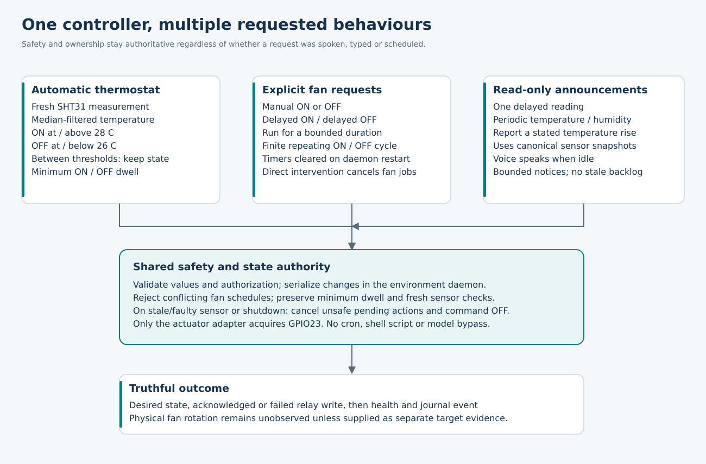
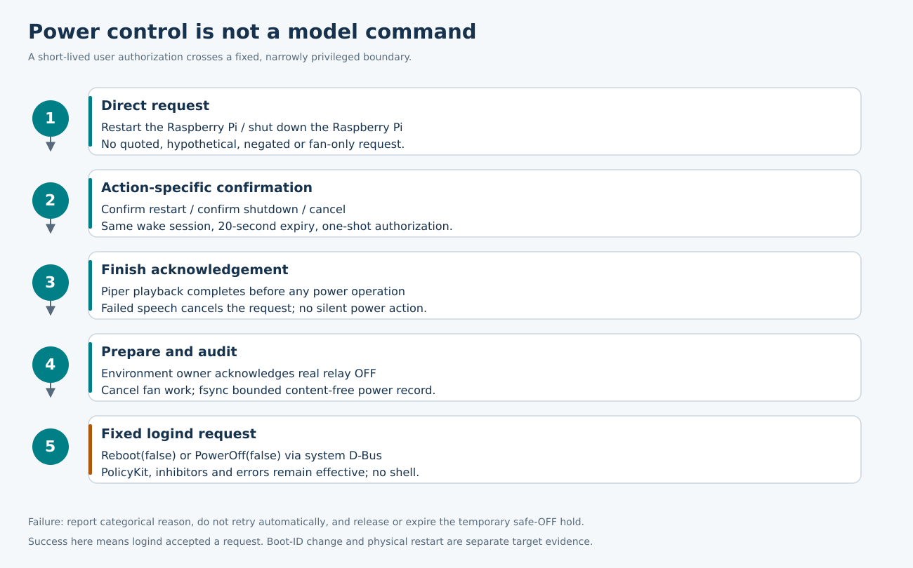

# GonKenLab Agent: current architecture and design

This describes implemented B12 code, not an assertion that the entire retained
Attempt03 blueprint is complete. The authoritative code lives in `src/gonken_agent`;
installer maintenance tools are under `scripts`. Paths in the table are repository
relative. Diagrams are native SVG with accessible titles/descriptions and no
external fonts, scripts, network references or embedded private content.

## 1. System boundaries

| Responsibility | Authoritative implementation | Boundary / consumers |
|---|---|---|
| Typed static configuration | `config.py`, `deployment.py` | Root-controlled site TOML merged with packaged defaults; unknown/invalid values fail before application |
| Capture, recognition and speech | `voice_runtime.py`, `audio/`, configured Whisper/Piper | The voice process alone uses microphone/speaker; no environment-owned TTS |
| Wake / capture endpoint | `voice_runtime.py`, `audio/endpoint.py` | Local wake recognition; acoustic completion controls use of inline commands |
| Operational intent | `operational.py`, `command_intents.py`, `environment/intents.py`, `spoken_numbers.py` | Direct user utterances become bounded typed requests; uncertain commands are clarified |
| General knowledge | `llm/ollama.py`, `llm/models.py`, `llm/admin.py` | Qualified selected local model; default `qwen3:0.6b`; thinking disabled |
| Model-proposed tools | `tool_broker.py` | Small schema allow-list; mutating proposal must match independent direct user authorization |
| Sensor ownership | `environment/service.py`, `environment/sensors/sht31.py` | Daemon samples I2C1 SHT31, validates CRC, tracks freshness; queries use its state |
| Thermostat policy | `environment/policy.py`, `environment/controller.py` | Mutable policy generation, hysteresis, dwell and sensor-fault decisions |
| Relay ownership | `environment/actuators/gpiod_relay.py`, `gpio_resolver.py` | One canonical RP1 GPIO23 line request; command-result metrics distinct from physical motion |
| Timer ownership | `environment/automation.py` | Monotonic bounded in-memory jobs, numeric notices, no shell/cron, no persistent catch-up |
| Local IPC | `environment/protocol.py`, `server.py`, `client.py` | Bounded AF_UNIX messages and group authorization, serialized operations |
| Confirmed power | `power.py`, `power_install.py`, `power_policy.py` | Two fixed logind actions; action/session/expiry binding; managed narrow PolicyKit grant |
| Current readiness | `runtime_readiness.py`, `component_status.py` | Boot/process/release/model/profile/config identity; not merely systemd process liveness |
| Evidence | `evidence.py`, `support.py`, `power_diagnostics.py`, installer collector | One canonical `.tar.bz2`; bounded content-free metadata; no raw speech/transcripts |
| Installation | `install-room-appliance.sh`, `bootstrap.sh`, `scripts/install.sh`, `scripts/lib/` | Wrapper selects explicit preset, bootstrap validates source/privilege, engine converges dependencies |
| Release lifecycle | `scripts/release_manager.py` and maintenance tools | Immutable candidate, seal, activation/current link and supported rollback |

## 2. Voice versus operational control

A voice turn captures a bounded audio file, transcribes it locally, routes the final
text, speaks an answer and returns to standby. Recognition audio and arbitrary
spoken answers are not retained as logs. Only a small fixed set of non-user Piper
cue phrases can enter the verified persistent cue cache.

Operational requests are checked before general inference. Temperature, humidity,
time, fan modes/thresholds, timers and power confirmation therefore do not wait for
an LLM to produce an action plan. General knowledge uses the selected small model.
Less-direct environmental questions may use the typed tool broker, whose mutation
authorization is independent of the model response. Nothing in a model response
can supply shell arguments, raw GPIO operations or a host shutdown authorization.

The eight-second question cap is no longer a mandatory wait for every utterance.
The optional enabled PCM endpoint requires sustained speech followed by quiet;
noise/no speech retains a bounded maximum. The wake loop itself remains a local
speech-recognition pipeline, not a zero-latency keyword ASIC. A complete inline
utterance needs both syntactic and acoustic evidence, preventing truncation of
"turn the fan on in two minutes" into an immediate ON command.

The current TTS/Whisper binaries are capabilities consumed by the voice service,
not invented independent systemd services. `gonken-agent.service` and
`gonken-environment.service` are separately supervised; model/audio loss does not
need to stop an already healthy thermostat.

## 3. Sensor, controller, actuator and timers

The SHT31 adapter reads temperature and humidity, checks CRC and provides the
sensor observation to the environment service. The controller derives filtered
control temperature and enforces recovery/staleness rules. The relay adapter
resolves the canonical GPIO line by identity rather than assuming every
`gpiochip0` has the same meaning. Only the environment daemon acquires the line.

`fan_power` describes controller intent. Actuator diagnostics distinguish the last
successfully commanded state, failed writes and an unknown command result.
Neither value proves fan blade motion; the current ELUTENG switching circuit has
no RPM or independent current/motion sensor. GPIO23 is the room-fan relay, not the
Raspberry Pi Active Cooler. Physical speed selection remains the fan's inline switch.

The explicit responsive-room deployment sets ON=28 C and OFF=26 C. Ordinary
restart preserves mutable policy. Timed manual overrides do not serialize a
surprise manual policy for the next boot. A direct explicit manual mode change is
persisted by the existing policy API. Simulated backends remain isolated test
facilities and are never a fallback for a failed full-real deployment.

The scheduler is in the same daemon and lock domain as control. Its only actions
are enumerated fan requests and read-only measurement notices. It never runs a
command string. Composite fan jobs cannot overlap; direct intervention cancels
relevant fan jobs. Dwell and fresh-sensor safety take precedence over requested
wall-clock precision. Restart clears jobs so old scheduled ON requests cannot
silently execute after reboot or update. Finite recurring leases and queue limits
avoid unbounded autonomous behavior.

Notifications carry bounded numeric sensor observations, not arbitrary user text.
The voice owner polls them while idle and acknowledges successful speech. That
acknowledgement is what advances the temperature-change baseline. Temporary voice
unavailability loses/ages out notices rather than obstructing sensor polling.

## 4. Reboot and shutdown

Only a direct user request creates a short-lived pending action. Matching
confirmation in the same interaction authorizes one execution. Audio completion,
relay safe-OFF preparation and an fsynced content-free audit occur before the
fixed logind call. Negative, quoted, hypothetical, expired, wrong-action and
replayed confirmations cannot authorize execution. No delayed power timer exists.

The runtime refuses execution as root. The installer grants the designated
`gonken-agent` identity only the named logind reboot/power-off authorization,
including the corresponding multiple-session checks; it does not grant
ignore-inhibitor or generic service-management rights. A denial, inhibitor,
missing helper or transport failure is reported without automatic retry.

The environment safe-OFF hold expires after 30 seconds if power did not occur;
explicit release also restores the controller after fresh sensor checks. A
successful D-Bus return is recorded as requested, not proof of a physical reboot.
The exact managed PolicyKit rule is removed by uninstall; an administrator-modified
rule is a conflict before destructive work, not something silently overwritten.

## 5. Deployment and recovery

The room wrapper is a preset selector, not a second installer. It delegates to
bootstrap with `--local-checkpoint`, `full-real`, automatic mode and the responsive
preset. The engine prepares the exact immutable candidate's dependencies before
activation. Existing selected real-thermostat configuration is reconciled early,
so an optional alternate-model failure cannot strand a stale simulated daemon.
Required selected/default capability failures still prevent false installation
success. Candidate model/speech failure does not imply the current thermostat is off.

Configuration fingerprints make same-release setting changes invalidate old
readiness. Readiness also binds boot/process/release/profile/model identity. It is
startup evidence, not a perpetual audio-health heartbeat. Component status exposes
unavailable/degraded capabilities rather than turning every running process green.

Full late semantic rollback of every mutable OS/model/config dependency remains
separately tracked in Attempt03. Do not claim that an immutable-code rollback
undoes arbitrary changed site policy or OS packages. Keep the exact source/history
and receipts; WIP branches preserve work but are not proof of release acceptance.

## 6. Extension rules and open design boundaries

Add a spoken command by extending a deterministic parser plus typed client/server
validation, not by adding a shell escape. Add a timed action only after defining
its resource owner, cancellation, dwell, timeout, replay and persistence semantics.
Add status fields to the canonical owner, then reuse them from CLI/voice/evidence.
New rendering code must not sample I2C or claim GPIO23.

The optional OSOYOO/HDMI/SSH live-console architecture is planned, not shipped in
B12. It must use canonical read-only presentation snapshots with independent
viewports, private memory-only content and no second hardware owner. GPIO17 touch
versus inactive PTT is governed by effective resource claims. The separate GPIO22
wake/privacy indicator is not released as a side effect of display work.

## 7. Evidence and authoritative external interfaces

Application behavior is defined by this source and its tests. The [README command
catalogue](../README.md#2-voice-command-catalogue) is backed by
[the machine example register](COMMAND_EXAMPLES.json); tests verify parser behavior,
not merely that examples are present as text. The receipt supplied beside the
archive identifies the exact bytes and executed regression cases.

External interface documentation used for implementation verification:
[Ollama chat API](https://docs.ollama.com/api/chat),
[Ollama thinking control](https://docs.ollama.com/capabilities/thinking),
[`qwen3:0.6b` model tag](https://ollama.com/library/qwen3:0.6b), and
[systemd logind interface](https://www.freedesktop.org/software/systemd/man/latest/org.freedesktop.login1.html).
These describe interfaces; they do not certify performance on this Raspberry Pi.
